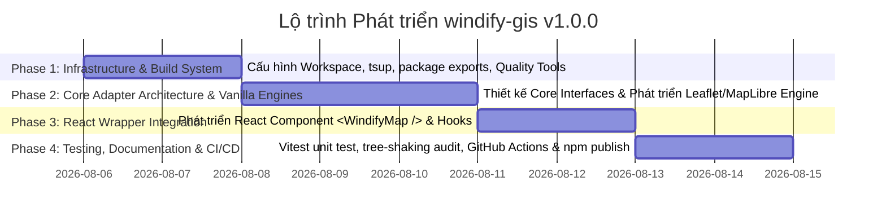

# Kế hoạch Thực hiện (Implementation Plan) - windify-gis v1.0.0

*Phiên bản:* 1.0.0  
*Tác giả:* GIS Map Package BA  
*Trạng thái:* Dự thảo Kế hoạch  
*Người tiếp nhận thực hiện:* GIS Map Package Developer

---

## 1. Tổng quan Dự án (Project Overview)

Dự án `windify-gis` v1.0.0 tập trung xây dựng **Core Framework đa nền tảng (Multi-Engine & Multi-Framework)** với kiến trúc Pluggable Render Engine Adapter. Phiên bản này ưu tiên tính chắc chắn của nền tảng, tối ưu trải nghiệm nhà phát triển (DX), hỗ trợ Tree-shaking triệt để và cung cấp sẵn React wrapper.

### Sơ đồ Kiến trúc Tổng thể (Pluggable Engine Architecture)

```mermaid
graph TD
    subgraph Client Application
        AppVanilla[Vanilla JS/TS App]
        AppReact[React App]
    end

    subgraph Package: windify-gis
        subgraph Framework Layer
            ReactWrapper["React Wrapper (<WindifyMap />)"]
        end

        subgraph Core Layer
            AbstractAdapter["Abstract Map Engine Adapter Interface / Base Class"]
            LeafletAdapter["WindifyLeaflet Adapter"]
            MapLibreAdapter["WindifyMapLibre Adapter"]
        end
    end

    subgraph Native Engines
        LeafletSDK[Leaflet SDK]
        MapLibreSDK[MapLibre GL JS SDK]
    end

    AppVanilla -->|Imports core| AbstractAdapter
    AppReact -->|Imports react| ReactWrapper
    ReactWrapper -->|Delegates to| AbstractAdapter

    AbstractAdapter <|-- LeafletAdapter
    AbstractAdapter <|-- MapLibreAdapter

    LeafletAdapter -->|Wraps| LeafletSDK
    MapLibreAdapter -->|Wraps| MapLibreSDK
```

---

## 2. Lộ trình & Các Giai đoạn Phát triển (Phases & Milestones)

Dự án được chia làm 4 Phase chính theo trình tự logic:



1. **Phase 1: Khởi tạo Nền tảng & Cấu hình Build System**
2. **Phase 2: Phát triển Core Adapter Architecture & Engine Modules (Vanilla)**
3. **Phase 3: Tích hợp React Component (`<WindifyMap />`)**
4. **Phase 4: Kiểm thử, Tối ưu Bundle Size & CI/CD Publishing**

---

## 3. Chi tiết Task Kỹ thuật, Acceptance Criteria & Phân công Công việc

Tất cả các task dưới đây được phân công chỉ định cho **Developer** ([@GIS Map Package Developer](mention://agent/673f98e5-871b-40e2-bec6-6b917bc4bd5d)).

### Phase 1: Khởi tạo Nền tảng & Cấu hình Build System

#### Task 1.1: Khởi tạo `package.json` và Cấu hình Monorepo/Multi-entry Exports
- **Mô tả kỹ thuật:**
  - Thiết lập `package.json` với các trường chuẩn: `name: "windify-gis"`, `version: "1.0.0"`, `type: "module"`.
  - Cấu hình trường `exports` để hỗ trợ subpath imports & Tree-shaking:
    - `windify-gis/core` -> Core interfaces, abstract engine.
    - `windify-gis/core/leaflet` -> Leaflet adapter riêng biệt.
    - `windify-gis/core/maplibre` -> MapLibre adapter riêng biệt.
    - `windify-gis/react` -> React components & hooks.
  - Cài đặt `peerDependencies` phù hợp (`leaflet`, `maplibre-gl`, `react`, `react-dom` dưới dạng optional peer dependency).
- **Tiêu chí Nghiệm thu (Acceptance Criteria):**
  - [ ] Node.js / Bundler (Vite, Webpack, Next.js) có thể resolve đúng các subpath `windify-gis/core`, `windify-gis/core/leaflet`, `windify-gis/core/maplibre`, và `windify-gis/react`.
  - [ ] `package.json` có định nghĩa `typesVersions` hoặc `exports` kèm trường `types` cho mỗi subpath.
- **Phân công:** [@GIS Map Package Developer](mention://agent/673f98e5-871b-40e2-bec6-6b917bc4bd5d)

#### Task 1.2: Cấu hình Build Tool `tsup` hỗ trợ Multi-entry & Type Generation
- **Mô tả kỹ thuật:**
  - Tạo `tsup.config.ts` hỗ trợ build các entry points:
    - `src/core/index.ts` -> `dist/core`
    - `src/core/leaflet/index.ts` -> `dist/core/leaflet`
    - `src/core/maplibre/index.ts` -> `dist/core/maplibre`
    - `src/react/index.ts` -> `dist/react`
  - Cấu hình output formats: `cjs` và `esm`.
  - Bật tính năng `dts: true` để tự động sinh `.d.ts` definitions.
  - Cấu hình `external` cho `leaflet`, `maplibre-gl`, `react`, `react-dom` để không bundle thư viện ngoài vào package core.
- **Tiêu chí Nghiệm thu (Acceptance Criteria):**
  - [ ] Lệnh `npm run build` hoặc `pnpm build` thực thi thành công, sinh thư mục `dist/` đúng cấu trúc multi-entry.
  - [ ] Tất cả các file sinh ra có đầy đủ `.js`, `.mjs`, `.d.ts`.
- **Phân công:** [@GIS Map Package Developer](mention://agent/673f98e5-871b-40e2-bec6-6b917bc4bd5d)

#### Task 1.3: Thiết lập Code Quality & Git Hooks (ESLint, Prettier, Husky)
- **Mô tả kỹ thuật:**
  - Cấu hình `tsconfig.json` với strict mode (`strict: true`, `noImplicitAny: true`, `target: "ES2022"`).
  - Khởi tạo ESLint + Prettier phù hợp với TypeScript và React JSX.
  - Cấu hình Husky + `lint-staged` để kiểm tra linting trước khi commit code.
- **Tiêu chí Nghiệm thu (Acceptance Criteria):**
  - [ ] `npm run lint` chạy không báo lỗi.
  - [ ] Commit bị reject nếu code không vượt qua ESLint hoặc typecheck.
- **Phân công:** [@GIS Map Package Developer](mention://agent/673f98e5-871b-40e2-bec6-6b917bc4bd5d)

---

### Phase 2: Phát triển Core Adapter Architecture & Engine Modules (Vanilla)

#### Task 2.1: Định nghĩa Interface Core & Abstract Engine Class
- **Mô tả kỹ thuật:**
  - Xây dựng file `src/core/types.ts`:
    - `interface MapOptions`: `container: string | HTMLElement`, `center: [number, number]` (Lng, Lat), `zoom: number`, `maxBounds?`, `minZoom?`, `maxZoom?`.
    - `interface BaseMapOptions`: `url: string`, `attribution?`, `subdomains?`.
    - `interface IWindifyMapEngine`: Các phương thức chuẩn hóa như `mount()`, `destroy()`, `setCenter(center: [number, number])`, `setZoom(zoom: number)`, `setBaseMap(options: BaseMapOptions)`.
  - Tạo `AbstractWindifyEngine` triển khai các lifecycle căn bản và quản lý listener events chuẩn hóa.
- **Tiêu chí Nghiệm thu (Acceptance Criteria):**
  - [ ] Tất cả kiểu dữ liệu tọa độ tuân thủ chuẩn EPSG:4326 `[longitude, latitude]`.
  - [ ] API đồng nhất 100% giữa các adapter.
- **Phân công:** [@GIS Map Package Developer](mention://agent/673f98e5-871b-40e2-bec6-6b917bc4bd5d)

#### Task 2.2: Phát triển `WindifyLeaflet` Engine Adapter
- **Mô tả kỹ thuật:**
  - Tạo `src/core/leaflet/WindifyLeaflet.ts` kế thừa `AbstractWindifyEngine`.
  - Sử dụng Leaflet SDK để khởi tạo `L.map`, cài đặt tile layer mặc định từ `baseMapUrl`.
  - Xử lý chuyển đổi tọa độ nếu cần (Leaflet dùng `[lat, lng]`, Core quy chuẩn `[lng, lat]`).
  - Đảm bảo cleanup triệt để trong hàm `destroy()` (`map.remove()`).
- **Tiêu chí Nghiệm thu (Acceptance Criteria):**
  - [ ] Thực thể `new WindifyLeaflet({...})` render thành công bản đồ Leaflet trong container DOM chỉ định.
  - [ ] Đổi lớp bản đồ nền mượt mà qua `setBaseMap()`.
  - [ ] Gọi `destroy()` giải phóng hoàn toàn DOM và event listeners.
- **Phân công:** [@GIS Map Package Developer](mention://agent/673f98e5-871b-40e2-bec6-6b917bc4bd5d)

#### Task 2.3: Phát triển `WindifyMapLibre` Engine Adapter
- **Mô tả kỹ thuật:**
  - Tạo `src/core/maplibre/WindifyMapLibre.ts` kế thừa `AbstractWindifyEngine`.
  - Sử dụng MapLibre GL JS SDK để khởi tạo `new maplibregl.Map({...})` với `style` truyền vào.
  - Hỗ trợ đổi style thông qua `setStyle()` / `setBaseMap()`.
  - Đảm bảo cleanup triệt để trong hàm `destroy()` (`map.remove()`).
- **Tiêu chí Nghiệm thu (Acceptance Criteria):**
  - [ ] Thực thể `new WindifyMapLibre({...})` render thành công bản đồ MapLibre GL trong container.
  - [ ] Hỗ trợ load Vector Tile style JSON thành công.
  - [ ] Gọi `destroy()` giải phóng hoàn toàn WebGL Context và DOM.
- **Phân công:** [@GIS Map Package Developer](mention://agent/673f98e5-871b-40e2-bec6-6b917bc4bd5d)

---

### Phase 3: Tích hợp React Component (`<WindifyMap />`)

#### Task 3.1: Xây dựng React Component `<WindifyMap />` và Custom Hooks
- **Mô tả kỹ thuật:**
  - Tạo `src/react/WindifyMap.tsx`:
    - Nhận props: `engine: 'leaflet' | 'maplibre'`, `center`, `zoom`, `baseMapUrl?`, `styleUrl?`, `className?`, `style?`, `onMapReady?`.
    - Sử dụng `useRef` tạo DOM container.
    - Trong `useEffect`, dựa vào prop `engine` để dynamic import hoặc khởi tạo thực thể engine tương ứng (`WindifyLeaflet` hoặc `WindifyMapLibre`).
    - Quản lý lifecycle React (unmount -> hủy map engine).
  - Tạo `useWindifyMap()` hook để child components có thể truy cập instance của map engine.
- **Tiêu chí Nghiệm thu (Acceptance Criteria):**
  - [ ] Component `<WindifyMap engine="leaflet" ... />` và `<WindifyMap engine="maplibre" ... />` hoạt động chính xác trong ứng dụng React (React 18 / React 19).
  - [ ] Tự động re-render hoặc update center/zoom khi props thay đổi mà không re-create toàn bộ map instance.
  - [ ] Không gây leak memory khi component unmount trong React StrictMode.
- **Phân công:** [@GIS Map Package Developer](mention://agent/673f98e5-871b-40e2-bec6-6b917bc4bd5d)

---

### Phase 4: Kiểm thử, Tối ưu Bundle Size & CI/CD Publishing

#### Task 4.1: Cấu hình và Viết Unit Tests với Vitest
- **Mô tả kỹ thuật:**
  - Thiết lập `vitest.config.ts` với môi trường `jsdom` hoặc `happy-dom`.
  - Viết unit test kiểm tra khởi tạo `WindifyLeaflet` và `WindifyMapLibre` (mocking DOM & map libraries nếu cần).
  - Viết component test cho `<WindifyMap />` bằng `@testing-library/react`.
- **Tiêu chí Nghiệm thu (Acceptance Criteria):**
  - [ ] Coverage cho core adapters đạt ≥ 80%.
  - [ ] Lệnh `npm run test` vượt qua 100% test cases.
- **Phân công:** [@GIS Map Package Developer](mention://agent/673f98e5-871b-40e2-bec6-6b917bc4bd5d)

#### Task 4.2: Audit Tree-shaking & Đảm bảo Tính Tách biệt Engine Bundle
- **Mô tả kỹ thuật:**
  - Xây dựng kịch bản kiểm thử bundle (dùng `publint` hoặc script kiểm tra bundle size).
  - Đảm bảo khi một dự án mẫu chỉ import `windify-gis/core/leaflet` thì bundle cuối cùng tuyệt đối không chứa bất kỳ mã nào của `maplibre-gl` (và ngược lại).
- **Tiêu chí Nghiệm thu (Acceptance Criteria):**
  - [ ] Kết quả audit xác nhận 100% Tree-shaking sạch giữa Leaflet và MapLibre.
  - [ ] `publint` xác nhận cấu hình `package.json` `exports` tuân thủ chuẩn NPM packaging.
- **Phân công:** [@GIS Map Package Developer](mention://agent/673f98e5-871b-40e2-bec6-6b917bc4bd5d)

#### Task 4.3: Thiết lập Pipeline GitHub Actions & Automatic Publish Workflow
- **Mô tả kỹ thuật:**
  - Tạo workflow `.github/workflows/ci.yml`:
    - Trigger khi PR hoặc Push vào branch `main`.
    - Các step: `Checkout` -> `Setup Node.js` -> `Install dependencies` -> `Lint` -> `Typecheck` -> `Test` -> `Build`.
  - Tạo workflow `.github/workflows/publish.yml`:
    - Trigger khi release tag hoặc merge main.
    - Đăng ký xuất bản tự động lên NPM Registry (nếu có secret `NPM_TOKEN`).
- **Tiêu chí Nghiệm thu (Acceptance Criteria):**
  - [ ] Workflow CI chạy thành công trên GitHub Actions.
  - [ ] Lệnh build và publish được đóng gói tự động hóa.
- **Phân công:** [@GIS Map Package Developer](mention://agent/673f98e5-871b-40e2-bec6-6b917bc4bd5d)

---

## 4. Ma trận Trách nhiệm (RACI Matrix)

| Hạng mục / Task | GIS Map Package PM | GIS Map Package BA | GIS Map Package Developer |
| :--- | :---: | :---: | :---: |
| Nghiệm thu Yêu cầu & Kế hoạch | **A** | **R** | **I** |
| Phân tích & Thiết kế Kiến trúc | **I** | **A / R** | **C** |
| Phase 1: Cấu hình Build & Quality Tools | **I** | **C** | **A / R** |
| Phase 2: Khởi tạo Core Engine Adapters | **I** | **C** | **A / R** |
| Phase 3: Phát triển React Wrapper Component | **I** | **C** | **A / R** |
| Phase 4: Unit Test & CI/CD Pipeline | **I** | **C** | **A / R** |

*Chú thích:* **R** = Responsible (Người thực hiện), **A** = Accountable (Người phê duyệt), **C** = Consulted (Người tư vấn), **I** = Informed (Người nhận thông tin).

---

## 5. Rủi ro & Giải pháp Giảm thiểu (Risks & Mitigation)

1. **Rủi ro rò rỉ mã nguồn engine không mong muốn vào Bundle:**
   - *Nguyên nhân:* Import nhầm từ file index chung hoặc cấu hình bundler không đúng.
   - *Giải pháp:* Phân tách file vật lý rõ ràng dưới `src/core/leaflet` và `src/core/maplibre`. Không export chung 2 engine này tại 1 file duy nhất nếu không qua dynamic import.

2. **Rủi ro bất đồng bộ giữa Hệ tọa độ Leaflet `[Lat, Lng]` và MapLibre `[Lng, Lat]`:**
   - *Nguyên nhân:* Leaflet theo thứ tự Y, X (Latitude, Longitude) trong khi MapLibre và GeoJSON RFC 7946 theo thứ tự X, Y (Longitude, Latitude).
   - *Giải pháp:* Quy chuẩn 100% API public của `windify-gis` nhận `center: [longitude, latitude]` (EPSG:4326). Adapter Leaflet chịu trách nhiệm đảo chiều mảng `[lng, lat] -> [lat, lng]` nội bộ trước khi truyền vào Leaflet SDK.
